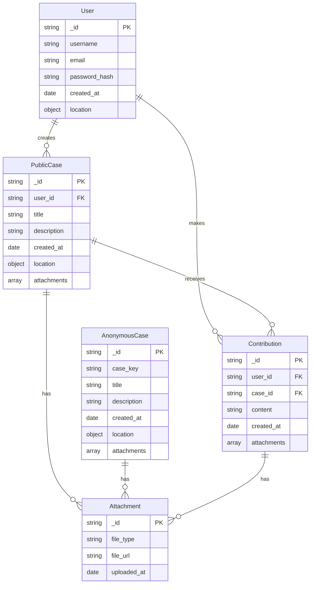

# Child Exploitation Reporting Application Documentation

## Table of Contents

1. Introduction
   1.1 Purpose
   1.2 Target Audience
   1.3 Key Features
2. User Guide
   2.1 Getting Started
   2.2 Public Case Reporting
   2.3 Anonymous Case Reporting
   2.4 Viewing and Interacting with Cases
   2.5 File Attachments
   2.6 User Profile Management
3. System Architecture
   3.1 Technology Stack
   3.2 High-Level Architecture
   3.3 Directory Structure
4. Application Design
   4.1 Data Models
   4.2 API Endpoints
   4.3 Authentication and Authorization
   4.4 File Handling
   4.5 Internationalization
   4.6 Error Handling
5. Application Flow
   5.1 User Registration and Authentication
   5.2 Case Creation and Management
   5.3 Feed Generation and Filtering
   5.4 File Upload and Management
   5.5 Anonymous Case Linking
6. Security Considerations
7. Testing Strategy
8. Deployment and DevOps
9. Future Enhancements

## 1. Introduction

### 1.1 Purpose

The Child Exploitation Reporting Application is a powerful platform designed to combat child abuse by providing a safe, accessible, and user-friendly way for individuals to report incidents of child exploitation. By combining the features of social media with anonymous reporting capabilities, the application aims to increase awareness, encourage reporting, and facilitate the tracking and resolution of child abuse cases.

### 1.2 Target Audience

- General public concerned about child welfare
- Child protection organizations and professionals
- Law enforcement agencies
- Social workers and child advocates
- Educational institutions

### 1.3 Key Features

- Anonymous reporting with unique case keys
- Public case reporting and viewing
- Location-based case feed
- User contributions to existing cases
- File attachments for evidence (images, videos)
- Multi-language support
- User authentication and profile management

## 2. User Guide

### 2.1 Getting Started

To use the application, users can either browse public cases without an account or register for full access:

1. Visit the application website or download the mobile app.
2. Click "Sign Up" to create an account or "Log In" if you already have one.
3. Complete the registration form with your details.
4. Verify your email address through the sent verification link.

### 2.2 Public Case Reporting

To create a public case:

1. Log in to your account.
2. Click on "Create New Case" or a similar button.
3. Fill in the case details:
   - Title
   - Description
   - Location (address, city, country)
   - Any relevant attachments (images, videos)
4. Review and submit your case.

Your case will now be visible in the public feed, allowing other users to view and contribute.

### 2.3 Anonymous Case Reporting

To report a case anonymously:

1. From the main page, select "Report Anonymously."
2. Provide case details:
   - Description
   - Location (as specific as you're comfortable with)
   - Any relevant attachments
3. Submit the case.
4. You'll receive a unique key for your case. Save this key securely to follow up or link future reports.

### 2.4 Viewing and Interacting with Cases

1. The main feed displays public cases based on your location.
2. Use filters to adjust the feed:
   - Set a specific location (coordinates)
   - Choose a city
   - Set a radius for nearby cases
3. Click on a case to view full details.
4. If logged in, you can:
   - Comment on the case
   - Provide additional information
   - Add attachments to support the case

### 2.5 File Attachments

To add file attachments:

1. When creating or contributing to a case, click "Add Attachment."
2. Select the file(s) you wish to upload (images or videos).
3. Wait for the upload to complete before submitting the case or contribution.

### 2.6 User Profile Management

1. Access your profile through the user menu.
2. Update your personal information, email, or password.
3. View your reported cases and contributions.

## 3. System Architecture

### 3.1 Technology Stack

- Backend: Node.js with Express.js
- Database: MongoDB
- File Storage: Supabase
- Authentication: Custom JWT-based implementation
- Testing: Japa
- Internationalization: typesafe-i18n

### 3.2 High-Level Architecture

The application follows a typical client-server architecture:

1. Client (Web/Mobile App)
2. API Layer (Express.js)
3. Business Logic Layer
4. Data Access Layer (Mongoose ODM)
5. Database (MongoDB)
6. External Services:
   - Supabase for file storage
   - Email service for notifications

### 3.3 Directory Structure

```
.
├── src
│   ├── application
│   │   ├── anonymous-cases
│   │   ├── attachment
│   │   ├── auth
│   │   ├── public-case
│   │   ├── stale-content
│   │   └── user
│   ├── db
│   ├── middleware
│   └── utils
├── tests
│   ├── api
│   └── utils
├── i18n
├── server.js
├── routes.js
└── task-scheduler.js
```

## 4. Application Design

### 4.1 Data Models

#### User

- Properties: username, email, password (hashed), name, lastname, is_verified, tp_status, created_at, updated_at
- Indexes: email (unique), username (unique)

#### PublicCase

- Properties: submitter (ref: User), title, description, reported_at, is_verified, attachment (ref: Attachment), updated_at, tp_status, location
- Indexes: location (2dsphere)

#### AnonymousCase

- Properties: key (ref: AnonymousKey), description, reported_at, tp_status, attachment (ref: Attachment), location
- Indexes: location (2dsphere)

#### Attachment

- Properties: filepaths (array of strings)

#### StaleContent

- Properties: filepath

#### AnonymousKey

- Properties: key (unique identifier)

### 4.2 API Endpoints

1. Authentication

   - POST /api/auth/signup
   - POST /api/auth/login

2. Public Cases

   - GET /api/public-case
   - POST /api/public-case
   - DELETE /api/public-case/:id

3. Anonymous Cases

   - GET /api/anonymous-case
   - POST /api/anonymous-case
   - DELETE /api/anonymous-case/:id

4. Attachments

   - POST /api/attachment/upload
   - GET /api/attachment/:id
   - DELETE /api/attachment/temporary

5. User Management
   - GET /api/user
   - GET /api/user/:id
   - DELETE /api/user/:id

### 4.3 Authentication and Authorization

The application uses a custom JWT-based authentication system:

1. User registers or logs in
2. Server validates credentials and issues a JWT
3. Client includes JWT in Authorization header for subsequent requests
4. Server validates JWT for protected routes

Authorization is role-based, with special permissions for admin users.

### 4.4 File Handling

File handling uses Supabase for storage:

1. Client requests a signed upload URL
2. Server generates URL and saves filepath to StaleContent
3. Client uploads file directly to Supabase
4. On case creation, files are associated with the case
5. Stale content is cleaned up periodically

### 4.5 Internationalization

The application supports multiple languages using typesafe-i18n:

1. Translations are stored in JSON files in the `i18n` directory
2. Server detects user's preferred language from headers
3. Responses include translated messages based on detected locale

### 4.6 Error Handling

The application uses custom error classes and a centralized error handling middleware:

1. Custom errors are defined for specific scenarios (e.g., AttachmentCreateUploadSignedUrlError)
2. Controllers use try-catch blocks to catch errors
3. Errors are passed to the handleResponse utility
4. handleResponse formats the error message and sends an appropriate HTTP response

## 5. Application Flow

### 5.1 User Registration and Authentication

1. User submits registration form
2. Server validates input and checks for existing users
3. If valid, password is hashed and user is saved to database
4. Verification email is sent
5. User logs in with credentials
6. Server validates and issues JWT
7. Client stores JWT for future requests

### 5.2 Case Creation and Management

Public Case:

1. Authenticated user submits case details
2. Server validates input and saves case to database
3. If attachments are included, they are associated with the case
4. Case appears in public feed

Anonymous Case:

1. User submits case details anonymously
2. Server generates unique key and saves case
3. Key is returned to user for future reference

### 5.3 Feed Generation and Filtering

1. Client requests feed with optional filters (location, radius)
2. Server queries database for matching cases
3. Results are paginated and returned to client
4. Client displays cases and allows interaction

### 5.4 File Upload and Management

1. Client requests signed upload URL
2. Server generates URL and saves filepath to StaleContent
3. Client uploads file to Supabase
4. On case creation/update, files are associated with case
5. Periodic task cleans up unused StaleContent

### 5.5 Anonymous Case Linking

1. User submits new anonymous case with existing key
2. Server validates key and associates new case
3. Linked cases can be retrieved together for analysis

## 6. Security Considerations

- All communications use HTTPS
- Passwords are hashed using bcrypt
- JWT tokens have short expiration times
- Input validation is performed on all user inputs
- File uploads are validated for type and size
- Rate limiting is implemented on sensitive endpoints

## 7. Testing Strategy

The application uses Japa for testing:

1. Unit tests for utilities and helpers
2. Integration tests for API endpoints
3. Mock external services (e.g., Supabase) for consistent testing
